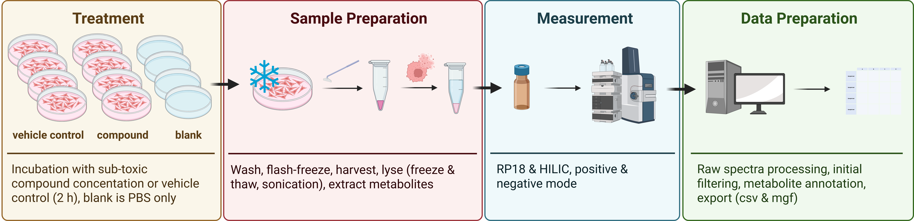

# metamorphr-data

This repository contains some of the data sets from a metabolomics experiment published in Schermer (2025). 
Raw spectral files can be downloaded from MetaboLights [@yurekten2024] <https://www.ebi.ac.uk/metabolights/MTBLS12332> study identifier [MTBLS12332](https://www.ebi.ac.uk/metabolights/editor/MTBLS12332/descriptors). 
The experimental setup is explained in detail in Schermer (2025) and a brief overview is shown in the figure below.

{#wf-overview}

The data from this repository is used in the vignettes of the [metamorphr package](https://github.com/yasche/metamorphr).

## References

Schermer, Y. (2025) <https://doi.org/10.1007/s11306-025-02309-0>
